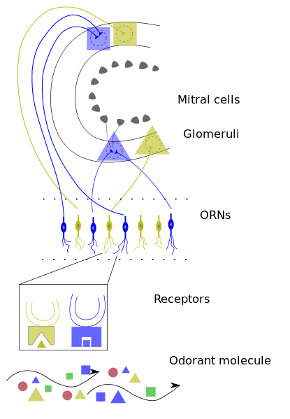
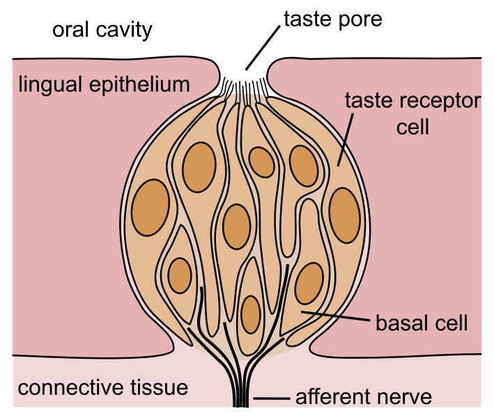

# Music Videos in R
### Presenting high-dimensional data in a web browser
<small><a href="http://thomaslevine.com">Thomas Levine</a></small>

<small><a href="http://csvsoundsystem.com">CSV Soundsystem</a></small>

# Big Data
Image goes here

# Data music videos are the answer.

## Reason 1: Static images are limited

<!-- http://upload.wikimedia.org/wikipedia/commons/2/29/Minard.png -->

### Senses: Vision

<!-- http://upload.wikimedia.org/wikipedia/commons/3/3e/Hawk_eye.jpg -->

### Senses: Hearing

<!-- http://upload.wikimedia.org/wikipedia/commons/1/1d/Earrr.JPG -->

### Senses: Touch

### Senses: Smell

<!-- http://upload.wikimedia.org/wikipedia/commons/thumb/0/07/Early_Olfactory_System.svg/415px-Early_Olfactory_System.svg.png -->

### Senses: Taste

<!-- http://upload.wikimedia.org/wikipedia/commons/thumb/0/0e/Taste_bud.svg/709px-Taste_bud.svg.png -->

## Reason 2: Audience

<!-- http://upload.wikimedia.org/wikipedia/commons/thumb/6/6e/HTML5-logo.svg/500px-HTML5-logo.svg.png -->
<pre><code>navigator.vibrate([1000, 500, 2000])</code></pre>
<!-- <a href="http://www.w3.org/TR/vibration/">HTML vibration API</a> -->

## Reason 3: Accessibility

<!-- http://www.section508.gov/images/open_doors_seal-b.jpg -->
 
<ul>
    <li><a href="https://www.section508.gov/">Section 508</a></li>
    <li><a href="http://www.w3.org/TR/WCAG10/">Web Content Accessibility Guidelines</a></li>
</ul>

## Reason 4: Reaching young people
<iframe width="560" height="315" src="http://www.youtube.com/embed/JwuEnyV1Cb0" frameborder="0" allowfullscreen></iframe>

# R is the best language
### for data music videos

<!-- http://www.r-project.org/Rlogo.jpg -->

## Reason 1: Vector graphics
A plot goes here.

## Reason 2: ddr
Sound waves go here.

## Reason 3: Data
    str(iris)
    'data.frame':   150 obs. of  5 variables:
    $ Sepal.Length: num  5.1 4.9 4.7 4.6 5 5.4 4.6 5 4.4 4.9 ...
    $ Sepal.Width : num  3.5 3 3.2 3.1 3.6 3.9 3.4 3.4 2.9 3.1 ...
    $ Petal.Length: num  1.4 1.4 1.3 1.5 1.4 1.7 1.4 1.5 1.4 1.5 ...
    $ Petal.Width : num  0.2 0.2 0.2 0.2 0.2 0.4 0.3 0.2 0.2 0.1 ...
    $ Species     : Factor w/ 3 levels "setosa","versicolor",..: 1 1 1 1 1 1 1 1 1 1 ...

# Two case studies

## Christmas Gifts
<iframe width="560" height="315" src="http://www.youtube.com/watch?v=rLZDvXPIDa0" frameborder="0" allowfullscreen></iframe>

### Architecture
Generate one page per frame.

    pdf('gifts_slideshow.pdf', width=3*16, height=3*9)

    for (day in 1:12) {
        #Frame with ordinal before gifts
        giftframe(0,day=day-1,daylabel=F)
        giftframe(0,day=day-1,daylabel=T)
        sapply(day:1,giftframe,day=day)
    }

    #Final frame with everything
    giftframe(0,day=12,daylabel=F)

    dev.off()

### Frame composition

<section data-state="blackout">
### Making pretty base R plots
[(live coding)](live-code-christmas.r)
</section>

### Side note
<!-- I intentionally repeat this slide. -->
# Use ggplot

## Federal spending
<!-- <iframe width="100%" height="100%" src="http://fms.csvsoundsystem.com" frameborder="0" allowfullscreen></iframe>
<iframe width="960px" height="100%" src="file:///home/tlevine/Documents/fms-symphony/index.html" frameborder="0" allowfullscreen></iframe> -->

### Architecture
<ol>
    <li>Download fixies from the FMS site, and convert them into CSV.</li>
    <li>Load into R, and produce the audio and video tracks.</li>
    <ol>
        <li>Generate 1877 plots, one per frame.</li>
        <li>Generate a song.</li>
    </ol>
    <li>Combine the frames and the song in a website.</li>
</ol>

### Architecture
Generate one image per frame.

    for (i in 1:nrow(table2.toplot)) {
        png(sprintf('slideshow/%d.png', i), width = 1200, height = 600)
        frame(i)
        dev.off()
    }

### Frame components
#### The full video

### Frame components
#### The part that we generate in R

<section data-state="blackout">
### Chernoff face hack
[(live coding)](live-code-fms.rive coding)
</section>

### Side note
<!-- I intentionally repeat this slide. -->
# Use ggplot

## Federal spending
<!-- <iframe width="100%" height="100%" src="http://fms.csvsoundsystem.com" frameborder="0" allowfullscreen></iframe>
<iframe width="960px" height="100%" src="file:///home/tlevine/Documents/fms-symphony/index.html" frameborder="0" allowfullscreen></iframe> -->

### Architecture
<ol>
    <li>Download fixies from the FMS site, and convert them into CSV.</li>
    <li>Load into R, and produce the audio and video tracks.</li>
    <ol>
        <li>Generate 1877 plots, one per frame.</li>
        <li>Generate a song.</li>
    </ol>
    <li>Combine the frames and the song in a website.</li>
</ol>

### Architecture
Generate one image per frame.

    for (i in 1:nrow(table2.toplot)) {
        png(sprintf('slideshow/%d.png', i), width = 1200, height = 600)
        frame(i)
        dev.off()
    }

### Frame components
#### The full video

### Frame components
#### The part that we generate in R

<section data-state="blackout">
### Chernoff face hack
[(live coding)](live-code-fms.r)
</section>

<section>
<h5>Plot one frame</h5>
<pre><code>
frame <- function(i) {
if (i <= 2) {
return
}
day.of.week.a <- strftime(table2.toplot[i,'date'], format = '%A')
bg <- bg.of.week[day.of.week.a][[1]]
fg <- fg.of.week[day.of.week.a][[1]]
par(
bg = bg
)
plot(
table2.toplot[1:i,'balance'] ~ table2.toplot[1:i,'date'],
type = 'n',
xlim = range(table2.toplot$date),
ylim = c(-2e5, 7e5), #range(table2.toplot$balance),
xlab = '', #Date
ylab = 'Cash in the bank (billions)', main = '', #'FMS Soundsystem',
axes = F, col = 4 # so we notice errors
)
abline(h = 0, col = fg)

# Rate
#range(table2.toplot$balance)

# Balance
polygon(
c(table2.toplot[1:i,'date'], table2.toplot[i:1,'date']),
c(table2.toplot[1:i,'balance'], table2.toplot[i:1,'balance']) + c(table2.toplot[1:i,'error'], - table2.toplot[i:1,'error']),
col = 1
)

# Under balance
rect(
xright =  min(table2.toplot$date),
ybottom = mean(range(table2.toplot$balance)) * 0.95,
xleft =   weighted.mean(range(table2.toplot$date), c(18, 3)),
ytop    = mean(range(table2.toplot$balance)) * 1.15,
col = 1
)
text(
x = min(table2.toplot$date),
y = mean(range(table2.toplot$balance)) * c(1.1, 1),
labels = c(
'Balance',
sub('\\$-', '-$', paste('$', as.character(round(table2.toplot[i,'balance'] / 1000)), ' billion', sep = ''))
),
pos = 4, font = 2:1, col = fg
)

# Under interest rate
rect(
xleft =   weighted.mean(range(table2.toplot$date), c(3, 18)),
ybottom = mean(range(table2.toplot$balance)) * 0.95,
xright =  max(table2.toplot$date),
ytop    = mean(range(table2.toplot$balance)) * 1.15,
col = 1
)
text(
x = max(table2.toplot$date),
y = mean(range(table2.toplot$balance)) * c(1.1, 1),
labels = c(
'Interest rate',
sub('\\$-', '-$', paste('$', as.character(round(table2.toplot[i,'balance'] / 1000)), ' billion', sep = ''))
),
pos = 2, font = 2:1, col = fg
)

# Under main
rect(
xleft   = weighted.mean(range(table2.toplot$date), c(2, 9)),
ybottom = weighted.mean(range(table2.toplot$balance), c(2, 15)),
xright  = max(table2.toplot$date),
ytop    = max(table2.toplot$balance),
col = 1
)
text(
x = weighted.mean(range(table2.toplot$date), c(1, 9)),
y = c(
weighted.mean(range(table2.toplot$balance), c(1, 15)),
weighted.mean(range(table2.toplot$balance), c(2, 15))
),
labels = c(
'FMS Soundsystem',
strftime(table2.toplot[i,'date'], format = '%B %Y')
),
col = fg, pos = 3, font = 2:1
)

ticks <- seq(-2e5, 6e5, 1e5)
axis(2, at = ticks, labels = round(ticks / 1000))
face(i,
x = table2.toplot[i,'date'],
y = table2.toplot[i,'balance'],
height = abs(diff(range(table2.toplot$balance))) / 5,
width = abs(diff(range(table2.toplot$date))) / 10,
labels = ''
)

par(new = T)
plot(
table2.toplot[1:i,'rate'] ~ table2.toplot[1:i,'date'],
axes = F, xlab = '', ylab = '', type = 'l', lty = 2,
xlim = range(table2.toplot$date), ylim = c(-2, max(table2.toplot$rate))
)
mtext("Federal interest rate", side=4, line=3)
axis(4, at = 0:5, labels = paste(0:5, '%', sep = ''), lty = 2)
}
</code></pre>
</section>

<section>
<h5>Plot one frame: How to use</h5>
<pre><code>
# Plot the 30th frame.
frame(30)
</code></pre>
</section>

<section>
<h5>Frame components</h5>

</section>

<section>
<h5><code>type="n"</code></h5>
<pre><code>
plot(
table2.toplot[1:i,'balance'] ~ table2.toplot[1:i,'date'],
type = 'n',
xlim = range(table2.toplot$date),
ylim = c(-2e5, 7e5), #range(table2.toplot$balance),
xlab = '', #Date
ylab = 'Cash in the bank (billions)', main = '', #'FMS Soundsystem',
axes = F, col = 4 # so we notice errors
)
</code></pre>
</section>

<section>
<h5>Confidence interval with <code>polygon</code></h5>
<pre><code>
# Balance
polygon(
c(table2.toplot[1:i,'date'], table2.toplot[i:1,'date']),
c(table2.toplot[1:i,'balance'], table2.toplot[i:1,'balance']) + c(table2.toplot[1:i,'error'], - table2.toplot[i:1,'error']),
col = 1
)
</code></pre>
</section>

<section>
<h5>More arguments to <code>plot</code></h5>
<pre><code>
par(new = T)
plot(
table2.toplot[1:i,'rate'] ~ table2.toplot[1:i,'date'],
axes = F, xlab = '', ylab = '', type = 'l', lty = 2,
xlim = range(table2.toplot$date), ylim = c(-2, max(table2.toplot$rate))
)
mtext("Federal interest rate", side=4, line=3)
axis(4, at = 0:5, labels = paste(0:5, '%', sep = ''), lty = 2)
</code></pre>
</section>

<section>
<h5>Frame components again</h5>

</section>

<section>
<h5>Things to remember</h5>
<!-- I intentionally repeat this slide. -->
<ul>
    <li>Base R graphics are powerful.</li>
    <li><code>locator</code> is helpful.</li>
    <li><strong>Use ggplot</strong> if you don't need this level of control.</li>
</ul>
</section>

<section>
<h2>CSV Soundsystem library</h2>
</section>

</body>
</html>
