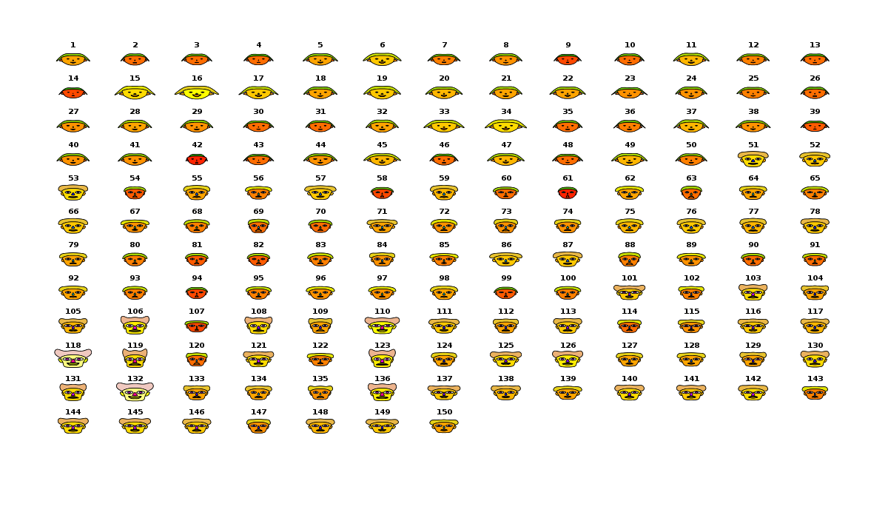

# Music Videos in R
### Presenting high-dimensional data in a web browser
<small><a href="http://thomaslevine.com">Thomas Levine</a></small>

<small><a href="http://csvsoundsystem.com">CSV Soundsystem</a></small>

# Big Data
Image goes here

# Data music videos are the answer.

## Reason 1: Static images are limited

<!-- http://upload.wikimedia.org/wikipedia/commons/2/29/Minard.png -->

### Senses: Vision

<!-- http://upload.wikimedia.org/wikipedia/commons/3/3e/Hawk_eye.jpg -->

### Senses: Hearing

<!-- http://upload.wikimedia.org/wikipedia/commons/1/1d/Earrr.JPG -->

### Senses: Touch

### Senses: Smell

<!-- http://upload.wikimedia.org/wikipedia/commons/thumb/0/07/Early_Olfactory_System.svg/415px-Early_Olfactory_System.svg.png -->

### Senses: Taste

<!-- http://upload.wikimedia.org/wikipedia/commons/thumb/0/0e/Taste_bud.svg/709px-Taste_bud.svg.png -->

## Reason 2: Audience

<!-- http://upload.wikimedia.org/wikipedia/commons/thumb/6/6e/HTML5-logo.svg/500px-HTML5-logo.svg.png -->
<pre><code>navigator.vibrate([1000, 500, 2000])</code></pre>
<!-- <a href="http://www.w3.org/TR/vibration/">HTML vibration API</a> -->

## Reason 3: Accessibility

<!-- http://www.section508.gov/images/open_doors_seal-b.jpg -->
 
<ul>
    <li><a href="https://www.section508.gov/">Section 508</a></li>
    <li><a href="http://www.w3.org/TR/WCAG10/">Web Content Accessibility Guidelines</a></li>
</ul>

## Reason 4: Reaching young people
<iframe width="560" height="315" src="http://www.youtube.com/embed/JwuEnyV1Cb0" frameborder="0" allowfullscreen></iframe>

# R is the best language
### for data music videos

<!-- http://www.r-project.org/Rlogo.jpg -->

## Reason 1: Vector graphics
A plot goes here.

## Reason 2: ddr
Sound waves go here.

## Reason 3: Data
    str(iris)
    'data.frame':   150 obs. of  5 variables:
    $ Sepal.Length: num  5.1 4.9 4.7 4.6 5 5.4 4.6 5 4.4 4.9 ...
    $ Sepal.Width : num  3.5 3 3.2 3.1 3.6 3.9 3.4 3.4 2.9 3.1 ...
    $ Petal.Length: num  1.4 1.4 1.3 1.5 1.4 1.7 1.4 1.5 1.4 1.5 ...
    $ Petal.Width : num  0.2 0.2 0.2 0.2 0.2 0.4 0.3 0.2 0.2 0.1 ...
    $ Species     : Factor w/ 3 levels "setosa","versicolor",..: 1 1 1 1 1 1 1 1 1 1 ...

# Two case studies

## Christmas Gifts
<iframe width="560" height="315" src="http://www.youtube.com/watch?v=rLZDvXPIDa0" frameborder="0" allowfullscreen></iframe>

<h4>Outline</h4>
<ol>
    <li>Constants: Labels, dimensions, &amp;c.</li>
    <li>Base plot with axes but no data</li>
    <li>Slide-specific drawings</li>
    <ol>
        <li><code>rect</code></li>
        <li><code>text</code></li>
    </ol>
    <li>Plot to pdf</li>
</ol>
</section>

<section>
<h4>Constants</h4>
<pre><code>#Day number labels
days=1:12
#Gift number labels
gifts.num=days

#Gift word labels
gifts.nonum=c(
'Drummers Drumming',
'Pipers Piping',
'Lords-a-Leaping',
'Ladies Dancing',
'Maids-a-Milking',
'Swans-a-Swimming',
'Geese-a-Laying',
'Gold Rings',
'Colly Birds',
'French Hens',
'Turtle Doves',
#'Partridge in a Pear Tree'
'Partridges in a Pear Tree'
)
gifts.nonum=gifts.nonum[length(gifts.nonum):1]
gifts=paste(1:12,gifts.nonum)
gifts[1]='A Partridge in a Pear Tree'

height.vid=9/16
width.vid=16/9</code></pre>
</section>

<section>
<h4>Base plot</h4>
<pre><code>baseplot=function(){
#Set up the coordinate system
plot(type='n',
x=-2+c(1,80),
y=-15+c(-15,height.vid*80-15),
xlim=-2+c(1,80),
ylim=-15+c(-15,height.vid*80-15),
asp=1,
xlab='',
ylab='',
main='',
axes=F,
)
}</code></pre>
</section>

<section data-state="blackout">
<h4>More about plotting</h4>
<a href="plot_parameters" target="_blank">Click here</a>
</section>

<section data-state="blackout">
<h4>Plot components</h4>

</section>

<section>
<h4>Draw one <code>rect</code></h4>
<pre><code>daygiftcount.fn=function(day) {
sum(gifts.num[1:day])
}

giftrect=function(gift,day=NA,col='grey80') {
daygiftcount=daygiftcount.fn(day)
rect(
#Gifts enter left to right
xleft  =daygiftcount-sum(gifts.num[0:(gift-1)]),
ybottom=0-day,
xright =daygiftcount-sum(gifts.num[1:gift]),
ytop   =1-day,

col=col,
border=NA
)
}</pre></code>
</section>

<section>
<h4>Combine rectangles</h4>
<pre><code>#Plot all of the gifts until the entered day
dayrect=function(day) {
for (pastday in 1:day) {
sapply(1:pastday,giftrect,day=pastday)
}
}</code></pre>
</section>

<section>
<h4>Axes</h4>

If you want axes done right, do them yourself.

<pre><code>tick=function(x,ybottom=0) {
lines(
rep(x,2),
c(ybottom,ybottom+1),
lwd=3,
col='grey80'
)
}

giftsperday=function(gift,day,daygiftcount,giftssofar) {
giftsperday.vector=sapply(1:12,daygiftcount.fn)
sapply(giftsperday.vector,tick,ybottom=-16)
lines(
x=c(0,0),
y=c(-18,0),
lwd=3,
col='grey80'
)
text(
x=giftsperday.vector,
y=-18,
labels=giftsperday.vector,
col='grey80',
pos=3,cex=6,
offset=0
)
text(
x=0,
y=-21,
labels='Gifts per day',
col='grey80',
pos=4,cex=6,
offset=0
)
}</code></pre>
</section>

<section>
<h4>Generate one page per frame</h4>
<pre><code>pdf('gifts_slideshow.pdf',
width =3*16,
height=3*9
)

for (day in 1:12) {
#Frame with ordinal before gifts
giftframe(0,day=day-1,daylabel=F)
giftframe(0,day=day-1,daylabel=T)
sapply(day:1,giftframe,day=day)
}
#Final frame with everything
giftframe(0,day=12,daylabel=F)

dev.off()</code></pre>
</section>

<section>
<h4>Things to remember</h4>
<!-- I intentionally repeat this slide. -->
<ul>
    <li>Base R graphics are powerful.</li>
    <li><code>locator</code> is helpful.</li>
    <li><strong>Use ggplot</strong> if you don't need this level of control.</li>
</ul>
</section>

<section>
<h3>Federal spending</h3>
<!-- <iframe width="100%" height="100%" src="http://fms.csvsoundsystem.com" frameborder="0" allowfullscreen></iframe>
<iframe width="960px" height="100%" src="file:///home/tlevine/Documents/fms-symphony/index.html" frameborder="0" allowfullscreen></iframe> -->

</section>

<section>
<h3>Federal spending</h3>
<ol>
    <li>Download fixies from the FMS site, and convert them into CSV.</li>
    <li>Load into R, and produce the audio and video tracks.</li>
    <ol>
        <li>Generate 1877 plots, one per frame.</li>
        <li>Generate a song.</li>
    </ol>
    <li>Combine the frames and the song in a website.</li>
</ol>
</section>

<section>
<h4>Video</h4>

</section>

<section>
<h5>The part that we generate in R</h5>

</section>

<section>
<h5>Overview: The main function</h5>
<pre><code>
main.plots <- function() {
for (i in 1:nrow(table2.toplot)) {
png(sprintf('slideshow/%d.png', i), width = 1200, height = 600)
frame(i)
dev.off()
}
}
</pre></code>

Now we'll walk through the code, glossing over the sections that are less specific to music videos.

</section>

<section>
<h5>Libraries</h5>
<pre><code>
library(plyr)
library(aplpack) # Cheroff faces
library(reshape2)
</code></pre>
</section>

<section>
<h5>Munge</h5>
<pre><code>
# Load the data
if (!'table2.raw' %in% ls()) {
table2.raw <- read.csv('table2-std.csv')

# Fix types
table2.raw$date <- as.Date(table2.raw$date)
table2.raw$type <- factor(table2.raw$type)
table2.raw$item <- factor(table2.raw$item)
table2.raw$today <- as.numeric(table2.raw$today)

source('data.r')
fed.rate <- read.csv('fed_rate.csv', stringsAsFactors = F)
fed.rate$date <- strptime(fed.rate$date, format = '%m/%d/%y')
}
table2 <- table2.raw[!table2.raw$is_total,c('date', 'type', 'item', 'today')]

# Select only the items that are present on all days.
n.days <- length(unique(table2$date))
table2.pca <- ddply(table2, c('type', 'item'), function(df) {
if (nrow(df) == n.days) {
df
}
})
</code></pre>
</section>

<section>
<h5>Turn 56 variables into 15 variables.</h5>
<pre><code>
# Run PCA
items <- dcast(table2.pca, date ~ type + item, value.var = 'today')[-1]
pca <- princomp(items, cor = T)
pca.stuff <- function() {
summary(pca)
plot(pca$sdev ~ I(1:length(pca$sdev)))
}
factored <- t(scale(items, center = pca$center, scale = pca$scale) %*% pca$loadings)
</code></pre>
</section>

<section>
<h5>Generate all 1877 faces.</h5>

This takes some time.

<pre><code>
# Make faces
f.all <- faces(t(factored)[,1:15], plot = F, print.info = F)
</code></pre>
</section>

<section data-state="alert">
<h5><code>aplpack</code> takes too long</h5>

<code>aplpack</code> can only plot <strong>all</strong> of the faces at once.

<pre><code>library(aplpack)
png('aplpack_problem.png', width=1200, height=700)
faces(iris[-5])
dev.off()</code></pre>

</section>

<section data-state="soothe">
<h5>Plot optimization hack</h5>
<pre><code>
# Plot a Chernoff face for a day at an x, y
face <- function(day.or.days, x, y, ...) {
# day.or.days is a row index

f <- f.all
f$xy <- f$faces <- NULL

f$xy <- matrix(f.all$xy[,day.or.days])
dimnames(f$xy) <- dimnames(f.all$xy)
f$faces <-f.all$faces[day.or.days]

x.pos <- x + abs(diff(range(table2.toplot$date)) / 20)

plot.faces(f, face.type = 1, x.pos = x.pos, y.pos = y, ...)
}

</code></pre>
</section>

<section>
<h5>Dunno what this does</h5>
<pre><code>
# Other plot stuff
table2.tmp <- ddply(table2.pca, 'date', function(df) { c(error = sd(df$today)) })
table2.toplot <- join(join(table2.tmp, fms.day[c('date', 'balance')]), fed.rate)
</code></pre>
</section>

<section>
<h5>More munging</h5>
<pre><code>
# Remove NAs
table2.toplot[c(358, 833, 1022, 1393, 1398),] <- table2.toplot[c(358, 833, 1022, 1393, 1398) - 1,]

# Skip the top 40 for rolling.
table2.toplot <- table2.toplot[-(1:40),]
</code></pre>
</section>

<section>
<h5>Colors</h5>
<pre><code>
# Video frame
bg.of.week <- c(
Sunday = '#DDDDDD',
Monday = '#FFDDDD',
Tuesday = '#DDFFDD',
Wednesday = '#DDDDFF',
Thursday = '#DDFFFF',
Friday = '#FFFFDD',
Saturday = '#FFDDFF'
)
fg.of.week <- c(
Sunday = '#000000',
Monday = '#00DDDD',
Tuesday = '#DDDD00',
Wednesday = '#DD00DD',
Thursday = '#DD0000',
Friday = '#00DD00',
Saturday = '#0000DD'
)
</code></pre>
</section>

<section>
<h5>Plot one frame</h5>
<pre><code>
frame <- function(i) {
if (i <= 2) {
return
}
day.of.week.a <- strftime(table2.toplot[i,'date'], format = '%A')
bg <- bg.of.week[day.of.week.a][[1]]
fg <- fg.of.week[day.of.week.a][[1]]
par(
bg = bg
)
plot(
table2.toplot[1:i,'balance'] ~ table2.toplot[1:i,'date'],
type = 'n',
xlim = range(table2.toplot$date),
ylim = c(-2e5, 7e5), #range(table2.toplot$balance),
xlab = '', #Date
ylab = 'Cash in the bank (billions)', main = '', #'FMS Soundsystem',
axes = F, col = 4 # so we notice errors
)
abline(h = 0, col = fg)

# Rate
#range(table2.toplot$balance)

# Balance
polygon(
c(table2.toplot[1:i,'date'], table2.toplot[i:1,'date']),
c(table2.toplot[1:i,'balance'], table2.toplot[i:1,'balance']) + c(table2.toplot[1:i,'error'], - table2.toplot[i:1,'error']),
col = 1
)

# Under balance
rect(
xright =  min(table2.toplot$date),
ybottom = mean(range(table2.toplot$balance)) * 0.95,
xleft =   weighted.mean(range(table2.toplot$date), c(18, 3)),
ytop    = mean(range(table2.toplot$balance)) * 1.15,
col = 1
)
text(
x = min(table2.toplot$date),
y = mean(range(table2.toplot$balance)) * c(1.1, 1),
labels = c(
'Balance',
sub('\\$-', '-$', paste('$', as.character(round(table2.toplot[i,'balance'] / 1000)), ' billion', sep = ''))
),
pos = 4, font = 2:1, col = fg
)

# Under interest rate
rect(
xleft =   weighted.mean(range(table2.toplot$date), c(3, 18)),
ybottom = mean(range(table2.toplot$balance)) * 0.95,
xright =  max(table2.toplot$date),
ytop    = mean(range(table2.toplot$balance)) * 1.15,
col = 1
)
text(
x = max(table2.toplot$date),
y = mean(range(table2.toplot$balance)) * c(1.1, 1),
labels = c(
'Interest rate',
sub('\\$-', '-$', paste('$', as.character(round(table2.toplot[i,'balance'] / 1000)), ' billion', sep = ''))
),
pos = 2, font = 2:1, col = fg
)

# Under main
rect(
xleft   = weighted.mean(range(table2.toplot$date), c(2, 9)),
ybottom = weighted.mean(range(table2.toplot$balance), c(2, 15)),
xright  = max(table2.toplot$date),
ytop    = max(table2.toplot$balance),
col = 1
)
text(
x = weighted.mean(range(table2.toplot$date), c(1, 9)),
y = c(
weighted.mean(range(table2.toplot$balance), c(1, 15)),
weighted.mean(range(table2.toplot$balance), c(2, 15))
),
labels = c(
'FMS Soundsystem',
strftime(table2.toplot[i,'date'], format = '%B %Y')
),
col = fg, pos = 3, font = 2:1
)

ticks <- seq(-2e5, 6e5, 1e5)
axis(2, at = ticks, labels = round(ticks / 1000))
face(i,
x = table2.toplot[i,'date'],
y = table2.toplot[i,'balance'],
height = abs(diff(range(table2.toplot$balance))) / 5,
width = abs(diff(range(table2.toplot$date))) / 10,
labels = ''
)

par(new = T)
plot(
table2.toplot[1:i,'rate'] ~ table2.toplot[1:i,'date'],
axes = F, xlab = '', ylab = '', type = 'l', lty = 2,
xlim = range(table2.toplot$date), ylim = c(-2, max(table2.toplot$rate))
)
mtext("Federal interest rate", side=4, line=3)
axis(4, at = 0:5, labels = paste(0:5, '%', sep = ''), lty = 2)
}
</code></pre>
</section>

<section>
<h5>Plot one frame: How to use</h5>
<pre><code>
# Plot the 30th frame.
frame(30)
</code></pre>
</section>

<section>
<h5>Frame components</h5>

</section>

<section>
<h5><code>type="n"</code></h5>
<pre><code>
plot(
table2.toplot[1:i,'balance'] ~ table2.toplot[1:i,'date'],
type = 'n',
xlim = range(table2.toplot$date),
ylim = c(-2e5, 7e5), #range(table2.toplot$balance),
xlab = '', #Date
ylab = 'Cash in the bank (billions)', main = '', #'FMS Soundsystem',
axes = F, col = 4 # so we notice errors
)
</code></pre>
</section>

<section>
<h5>Confidence interval with <code>polygon</code></h5>
<pre><code>
# Balance
polygon(
c(table2.toplot[1:i,'date'], table2.toplot[i:1,'date']),
c(table2.toplot[1:i,'balance'], table2.toplot[i:1,'balance']) + c(table2.toplot[1:i,'error'], - table2.toplot[i:1,'error']),
col = 1
)
</code></pre>
</section>

<section>
<h5>More arguments to <code>plot</code></h5>
<pre><code>
par(new = T)
plot(
table2.toplot[1:i,'rate'] ~ table2.toplot[1:i,'date'],
axes = F, xlab = '', ylab = '', type = 'l', lty = 2,
xlim = range(table2.toplot$date), ylim = c(-2, max(table2.toplot$rate))
)
mtext("Federal interest rate", side=4, line=3)
axis(4, at = 0:5, labels = paste(0:5, '%', sep = ''), lty = 2)
</code></pre>
</section>

<section>
<h5>Frame components again</h5>

</section>

<section>
<h5>Things to remember</h5>
<!-- I intentionally repeat this slide. -->
<ul>
    <li>Base R graphics are powerful.</li>
    <li><code>locator</code> is helpful.</li>
    <li><strong>Use ggplot</strong> if you don't need this level of control.</li>
</ul>
</section>

<section>
<h2>CSV Soundsystem library</h2>
</section>

</body>
</html>
